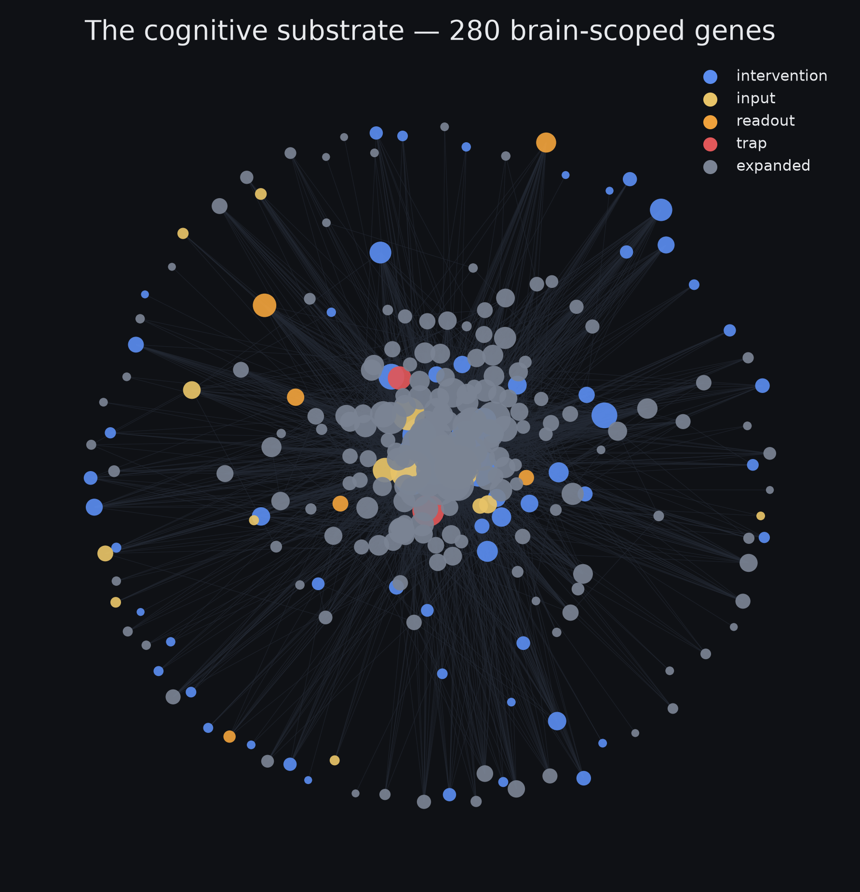
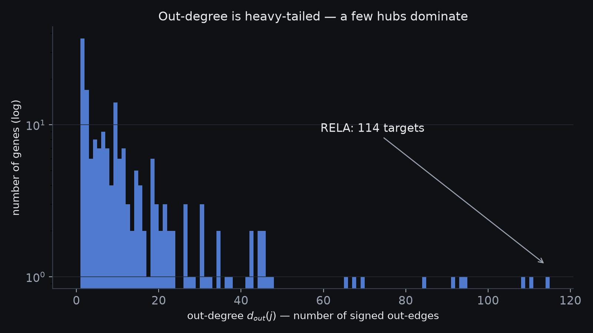
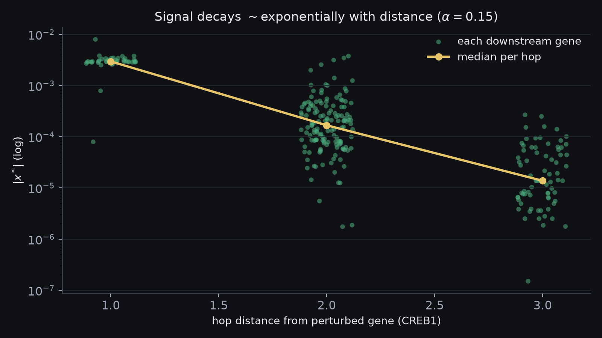
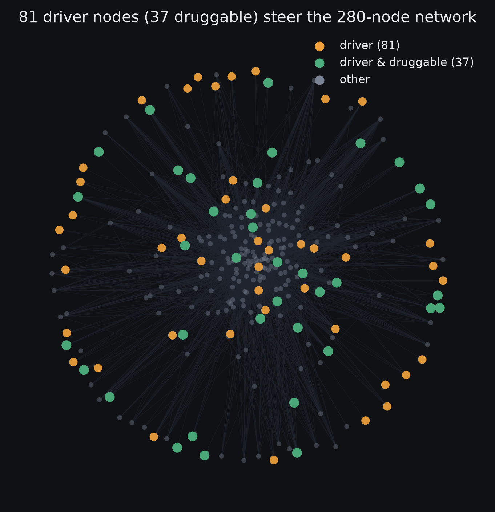
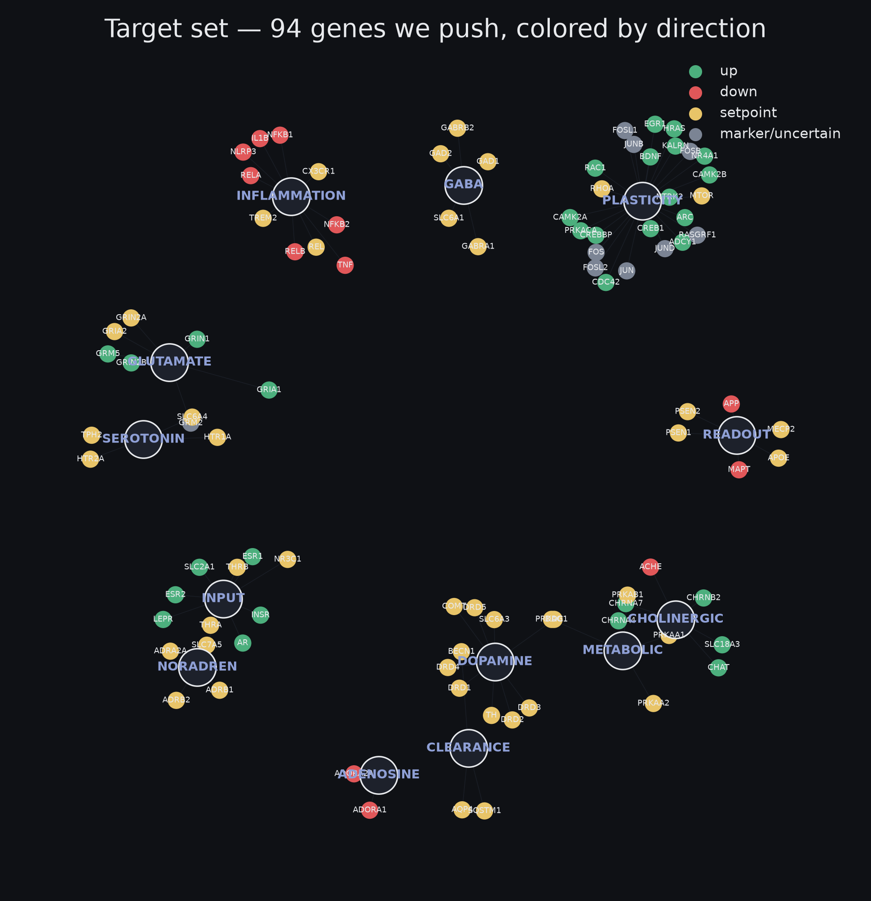
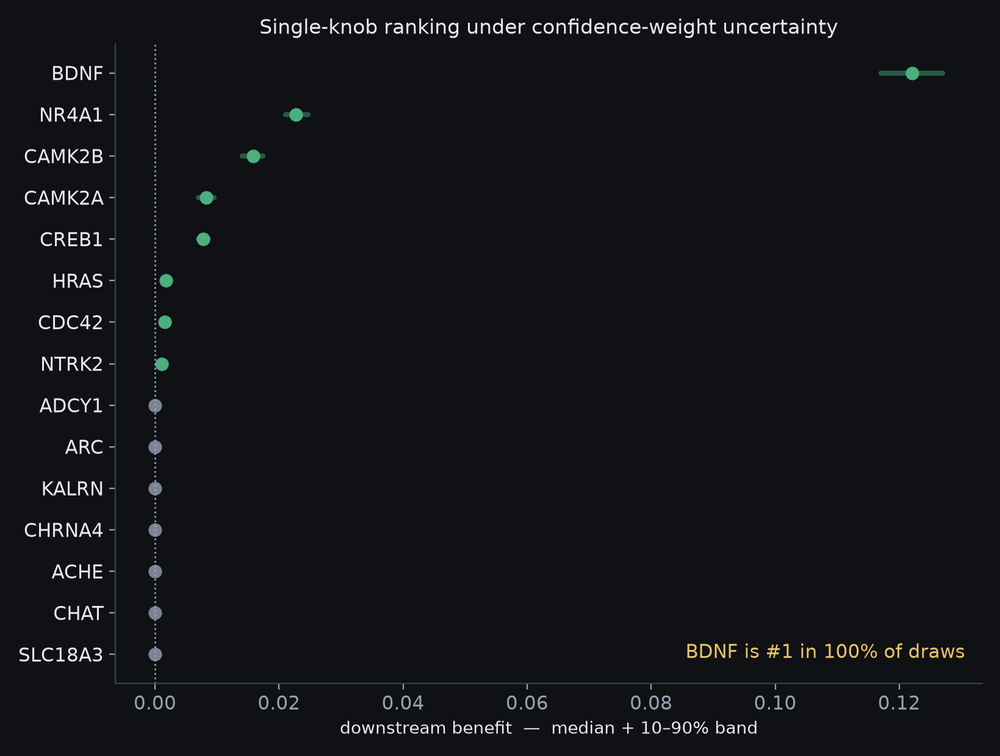
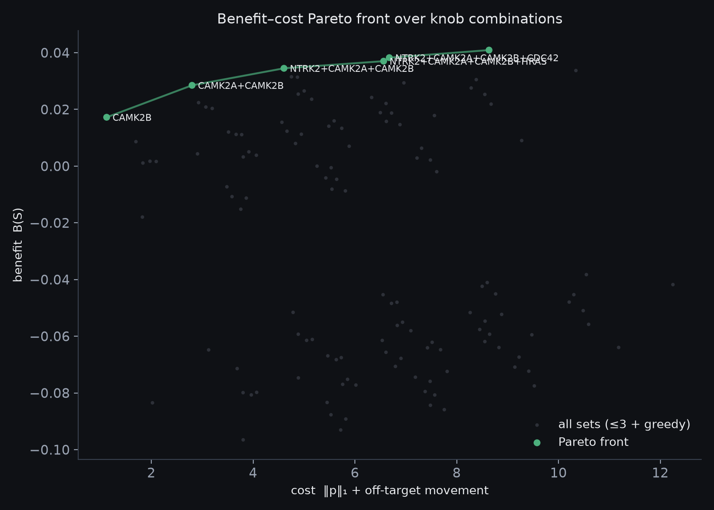
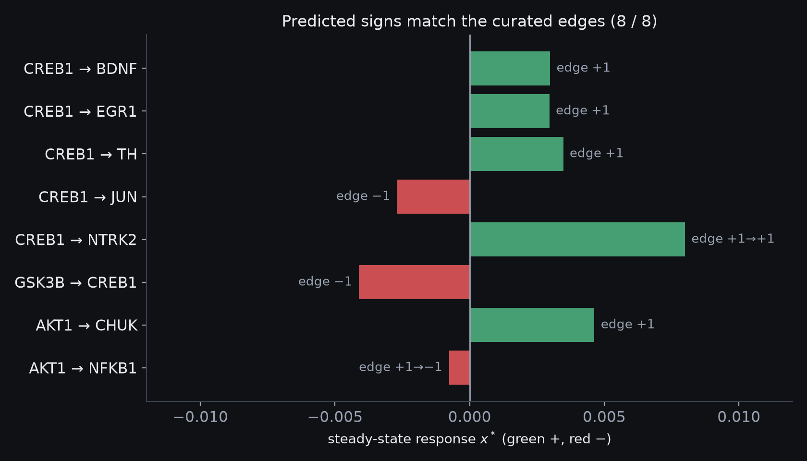
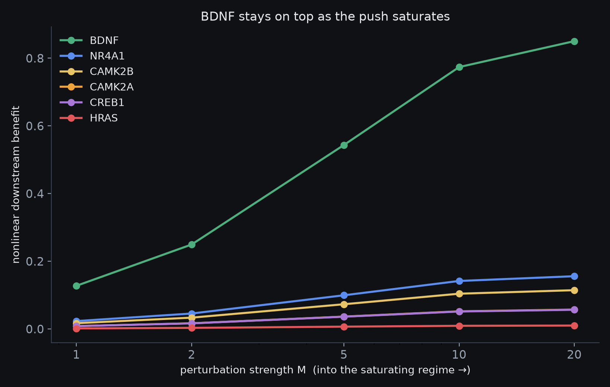

# A Network-Control Approach to a Learning-Optimal Brain State

**Dhruv Singh** · Work in progress · a personal project · July 2026

> ⚠️ **Status — a math experiment, not a research contribution.** Nothing here is novel. Every method is off-the-shelf, applied to a public knowledge graph as a way to learn the machinery. A personal learning project, not peer-reviewed, with no experimental validation of any kind. The full chain runs end to end — substrate, propagation, controllability, objective, uncertainty, optimizer — with a first result (§7) that survives a nonlinear cross-check (§8), but it is a *model exercise*, not a finding anyone should act on. Refinement continues; feedback welcome.

> **Overview.** This project treats a biomedical knowledge graph as a signed, directed control system and asks a simple question with a hard answer: which genes would you nudge, and by how much, to move the brain toward a state that's good for learning — without disturbing everything else? The scoring objective, uncertainty pass, and optimizer now run end to end — restricted to pushing **un-defended upstream drivers**, not defended hubs like BDNF (moved indirectly). The result: **CAMK2B** is the standout single lever, with a small optimal set and steep diminishing returns rather than a synergistic stack; the benefit is modest and honest, and it holds under a nonlinear cross-check.

> **What this is not.** A contribution. The methods are all standard — Personalized PageRank, Liu–Barabási controllability, ε-constraint Pareto, Monte-Carlo uncertainty — and the inputs are weak: a sparse, sign-only graph and a hand-built target vector. The interesting part is the *plumbing*: wiring those pieces into one pipeline that stays honest about what it doesn't know. Treat every number here as an exercise, not evidence.

*Academic-styled HTML version: [deep-dive.html](deep-dive.html)*

## 1. Substrate

The base graph is PrimeKG [1] — 129,375 nodes and about 4 million edges across ten types (genes, drugs, diseases, pathways, and so on), from the Hetionet / Rephetio line of work [2].

Most of that graph has nothing to do with learning, so I keep only genes mostly expressed in brain tissue. The score for a gene $v$ is the fraction of the tissues it appears in that are brain, over PrimeKG's `anatomy_protein_present` edges $E_a$:

$$e(v)=\frac{\bigl|\{a:(v,a)\in E_a,\ a\in A_{\mathrm{brain}}\}\bigr|}{\bigl|\{a:(v,a)\in E_a\}\bigr|},\qquad \text{keep if } e(v)\ge 0.15 \ \wedge\ \deg_a(v)\ge 5 \tag{1}$$

*In words —* keep a gene only if a decent share of the tissues it's active in are brain, and only if it's active in enough places for that share to mean something.

After pruning: 280 nodes in four layers (70 intervention, 15 input, 6 readout, 2 off-limits, 187 one-hop neighbors), 3,912 directed edges (2,871 signed: 2,253 activating, 618 inhibiting), one 200-node feedback loop.

## 2. The propagation operator

Put the edges in a matrix $W$: the entry $W_{ij}$ is $+1$, $-1$, or $0$ for the effect of gene $j$ on gene $i$. A hub gene with many out-edges would swamp everything, so divide each gene's column by its out-degree — the PageRank trick [3] ($d^{\mathrm{out}}_j=\sum_i|W_{ij}|$):

$$\hat{W}=W\,D_{\mathrm{out}}^{-1},\qquad \hat{W}_{ij}=\frac{W_{ij}}{\sum_k|W_{kj}|} \tag{2}$$

*In words —* spread each gene's outgoing effect evenly across the genes it points at, so one gene that talks to everyone can't dominate.

Each column now sums to 1 in absolute value, forcing the largest eigenvalue to be $\le 1$ (Perron–Frobenius) and keeping the next step stable (measured: $\rho(\hat W)=0.544$). Dividing by out-degree suits a *directed* graph; the symmetric GCN form $D^{-1/2}\tilde W D^{-1/2}$ [6] is for undirected graphs.

## 3. Propagation by random-walk-with-restart

Push a signal $p$ into one gene and let it spread, pulling a fraction $\alpha$ back to the source each step [5,4]:

$$x^{(t+1)}=(1-\alpha)\,\hat{W}x^{(t)}+\alpha\,p \tag{3}$$

*In words —* at each step, spread the signal one hop, but yank a fixed slice $\alpha$ back to the gene you started from.

Solving for the value it settles to gives a closed form (a sum over every path length $k$):

$$x^{*}=\alpha\bigl(I-(1-\alpha)\hat{W}\bigr)^{-1}p=\alpha\sum_{k\ge0}(1-\alpha)^{k}\hat{W}^{k}p \tag{4}$$

*In words —* the settled response; each extra hop is discounted by $(1-\alpha)^k$, so far-away genes barely feel it.

Far hops are discounted, so the effect stays local. The 200-node feedback loop is why we solve for a settled value instead of one push.

## 4. Controllability

Can a few inputs steer the whole thing? As a linear system with input map $B$, $\dot{x}=Wx+Bu$, it's fully steerable when the controllability matrix has full rank (Kalman [7]):

$$\operatorname{rank}\mathcal{C}=N,\qquad \mathcal{C}=[\,B,\ WB,\ W^{2}B,\ \dots,\ W^{N-1}B\,] \tag{5}$$

*In words —* you can reach any state exactly when your inputs, pushed through more and more hops, together cover all $N$ directions.

Testing that directly is impractical, so I use structural controllability (Lin [8]; Liu–Slotine–Barabási [9]): the fewest genes you must control is the number left unmatched after pairing up the network as well as possible,

$$N_{D}=\max\bigl(N-|M^{*}|,\ 1\bigr) \tag{6}$$

*In words —* match each gene to one it directly drives; whatever's left over is what you control by hand.

Matching via Hopcroft–Karp [10]. Result: all 280 reachable, but full control needs **81 driver genes, only 37 druggable** — so you can't push it to any state. You *can* steer the readouts you care about (target control [11]), which takes fewer inputs.

| quantity | value |
|---|---|
| druggable inputs \|𝒟\| | 172 |
| reachable \|R\|/N | 280 / 280 |
| min drivers N_D (full) | 81 |
| drivers druggable | 37 / 81 |
| feedback SCC | 200 |

### Formal target controllability

"You can steer the readouts" was an assumption above. The actual test: with outputs $y=Cx$ selecting the scored targets $S$, that set is fully controllable iff the target-controllability matrix has full row rank [11]:

$$\operatorname{rank}\bigl[\,CB,\ C\hat{W}B,\ C\hat{W}^{2}B,\ \dots\,\bigr]\;=\;|S|$$

*In words —* count how many independent directions of the target state your inputs can actually reach. Fewer than $|S|$ means you can push it along a subspace, but not drive it anywhere you like.

Against the 78 scored targets present in the graph:

| input set | inputs | rank / \|S\| | coverage |
|---|---|---|---|
| constrained drivers (un-defended, §7) | 7 | 72 / 78 | 92% |
| all druggable knobs (unconstrained) | 24 | 73 / 78 | 94% |
| every node (graph ceiling) | 280 | 78 / 78 | 100% |

The seven un-defended drivers span **92%** of the target space — they steer it rather than merely nudge it. And refusing to push the defended hubs costs just *one* dimension (92% vs 94%), so the constraint in §7 is nearly free. (Within the model, of course — the graph is the graph.)

## 5. Target state and objective

The target is a vector $d$ of desired changes. Key fact: most brain variables have a sweet spot, an inverted-U (Yerkes–Dodson [18]; Arnsten [19]) — dopamine, arousal, cortisol, E/I balance, mTOR. Benefit is how much closer to the target you get:

$$b_i=\lvert d_i\rvert-\lvert x^{*}_i-d_i\rvert \tag{7}$$

*In words —* positive if the nudge moved a gene toward its ideal level, negative if it pushed past it.

Total benefit weights each gene by confidence (readouts count 0); cost is effort plus off-target movement:

$$B(p)=\sum_i w_i\,b_i,\qquad C(p)=\lVert p\rVert_1+\gamma\sum_{j\,\notin\,T}\lvert x^{*}_j\rvert \tag{8}$$

*In words —* add up the good across genes, then subtract the cost: effort plus collateral elsewhere.

Current target vector: 94 genes, 43 set-point / 30 up / 12 down.

## 6. Uncertainty quantification

Our confidence in each target isn't uniform — some directions are well-established, others shaky — so a single score would overstate precision. We run it many times, sampling each target's confidence weight within its interval (Monte-Carlo [12]), and report a range,

$$\widehat{\mathrm{CI}}_{90\%}=\bigl[\,Y_{(\lceil0.05M\rceil)},\ Y_{(\lfloor0.95M\rfloor)}\,\bigr] \tag{9}$$

*In words —* run it many times, sort the scores, report the middle 90% as an honest range.

Then use Sobol indices [13,14] to see which unknown drives the range:

$$S_i=\frac{\operatorname{Var}_{\theta_i}\!\bigl(\mathbb{E}[Y\mid\theta_i]\bigr)}{\operatorname{Var}(Y)},\qquad S_{T_i}=\frac{\mathbb{E}\bigl[\operatorname{Var}(Y\mid\theta_{\sim i})\bigr]}{\operatorname{Var}(Y)} \tag{10}$$

*In words —* of all the wobble in the score, how much comes from each unknown — so you know which fact to check first.

Edge *strengths* are deliberately left out: they're treated as sign-only (unit weight), because there's no principled distribution to sample — inventing one would add noise, not information.

## 7. Optimization

No single best answer — more benefit usually costs more — so the output is a trade-off curve (Pareto front), traced with the ε-constraint method [15]:

$$\max_p\ B(p)\quad\text{s.t.}\quad C(p)\le\varepsilon \tag{11}$$

*In words —* squeeze out the most benefit at each cost budget, then vary the budget to draw the whole curve.

A plain weighted sum would quietly skip part of the curve when it bends the wrong way (non-convex) [16,17]; ε-constraint doesn't.

**A necessary constraint.** The optimizer may only push un-defended upstream drivers — nodes that cascade (out-degree > 0) but aren't heavily regulated (low in-degree). Defended hubs like BDNF (15 regulators) and CREB1 are excluded, treated as targets we move *indirectly* — homeostasis fights a direct push. (The Liu–Barabási driver *set* is non-unique, so we use the deterministic in-degree criterion.)

**Result.** Among those drivers, counting only the downstream effect, **CAMK2B** (CaMKIIβ, in-degree 0) is the top single lever — #1 in **100%** of the 2,000 draws, and it holds #1 under the nonlinear cross-check. Benefit is *modest*: un-defended drivers reach less of the network than the hubs we can't push — the honest answer.

For combinations, the constrained set is small enough that no heuristic is needed: all $2^{7}-1=127$ subsets are evaluated **exhaustively**, so the front below is provably optimal within the constraint — not a greedy approximation that might have missed a better set. (Greedy forward selection is still run as a cross-check; it lands on the front but misses one point, which is the reason to prefer the exhaustive sweep while it stays cheap.)

| # | knob set | benefit | cost |
|---|---|---|---|
| 1 | CAMK2B | +0.0172 | 1.12 |
| 2 | CAMK2A + CAMK2B | +0.0285 | 2.80 |
| 3 | NTRK2 + CAMK2A + CAMK2B | +0.0345 | 4.61 |
| 4 | NTRK2 + CAMK2A + CAMK2B + HRAS | +0.0370 | 6.57 |
| 5 | NTRK2 + CAMK2A + CAMK2B + CDC42 | +0.0383 | 6.68 |
| 6 | NTRK2 + CAMK2A + CAMK2B + CDC42 + HRAS | +0.0409 | 8.64 |

The **knee is CAMK2B** alone — best benefit per unit cost — then steep diminishing returns: the last four points buy roughly twice the benefit for roughly eight times the cost. The drivers act on largely independent downstream, so combinations are close to additive (no synergistic stack); the efficient set stays small.

## 8. Validation

Test-driven throughout — each stage is gated by unit tests. The main sign check: push one gene by $+1$ and confirm the response sign matches the edge sign in the database — not the model. All eight match ($\alpha=0.15$, $\rho=0.544$):

| perturb | → target | edge | $x^{*}$ | check |
|---|---|---|---|---|
| `CREB1 ↑` | BDNF | +1 | +0.0030 | ✓ |
| `CREB1 ↑` | JUN | −1 | −0.0027 | ✓ flip |
| `CREB1 ↑` | NTRK2 | +1→+1 | +0.0080 | ✓ net |
| `GSK3B ↑` | CREB1 | −1 | −0.0041 | ✓ inhib |
| `AKT1 ↑` | NFKB1 | +1→−1 | −0.0008 | ✓ net-flip |

One nice check: two-hop `NTRK2` moves more than one-hop `BDNF`, because CREB1's ~40 out-edges split its signal while BDNF's single out-edge passes it straight through — exactly what (2) predicts.

**Nonlinear cross-check.** The engine is linear, so the headline could be an artifact. Re-running the constrained ranking under a saturating (tanh) propagation, pushing knobs deep into the nonlinear regime: **CAMK2B stays #1 at every strength** (its lead grows as the system saturates), and combinations stay roughly additive (no synergy). The finding survives.

## 9. Groundedness and assumptions

The layers rest on very different evidence: brain-scoping is computed, edge signs are curated from causal databases, edge strengths are mostly sign-only, and the target vector is hand-built by me. $\hat W$ is a linear (first-order) stand-in for nonlinear biology, so results hold for small nudges near the resting state, not big ones. Everything above is internally consistent and tested; none of it is externally validated.

Concretely, the result "CAMK2B is the best lever" is a statement about *this graph under this objective*. For it to mean anything about an actual brain, all of the following would have to hold — and I have checked none of them:

- the edge set is roughly complete for this subsystem (it isn't — the graph is sparse, and absent edges are indistinguishable from absent biology)
- sign-only weights are a fair stand-in for real interaction strengths
- the hand-built target vector actually describes a learning-optimal state, rather than my reading of it
- a "push" on a gene corresponds to something a real intervention does — dose, timing, tissue, and compensation are all outside the model
- nothing important is missing that isn't a gene: metabolism, circuit dynamics, glia, and everything downstream of transcription

So the honest output is an *ordered list under stated assumptions* and a trade-off map — not fold-changes, not predictions, and emphatically not medical advice. The value of the exercise is the machinery, not the answer: a working pipeline from public graph to constrained, uncertainty-quantified, provably-optimal-within-the-constraint intervention sets. Point it at a better graph and a validated target vector and the same code would be worth something. As it stands it's a math experiment that happens to be about neurons.

## 10. Status & roadmap

**Built, tested, and run:** the full pipeline — substrate (§1), operator + RWR engine (§2–3), structural *and* formal target controllability (§4), the objective (§5), the uncertainty pass (§6), the constrained ε-constraint optimizer over an exhaustive combination sweep (§7), and the nonlinear cross-check (§8). **Further out:** real edge strengths where measured data exists, a richer intervention model (dose, timing), and validation against real perturbation datasets — the last of which is the only thing that would turn any of this from an exercise into evidence. A living write-up.

---

## References

1. Chandak, P., Huang, K., Zitnik, M. Building a knowledge graph to enable precision medicine. *Scientific Data* **10**, 67 (2023).
2. Himmelstein, D.S. et al. Systematic integration of biomedical knowledge prioritizes drugs for repurposing. *eLife* **6**, e26726 (2017).
3. Page, L., Brin, S., Motwani, R., Winograd, T. The PageRank Citation Ranking. *Stanford InfoLab* (1999).
4. Gasteiger, J., Bojchevski, A., Günnemann, S. Predict then Propagate: GNNs meet Personalized PageRank (APPNP). *ICLR* (2019).
5. Tong, H., Faloutsos, C., Pan, J-Y. Fast Random Walk with Restart and Its Applications. *ICDM* (2006).
6. Kipf, T.N., Welling, M. Semi-Supervised Classification with Graph Convolutional Networks. *ICLR* (2017).
7. Kalman, R.E. Mathematical Description of Linear Dynamical Systems. *J. SIAM Control* **1**(2), 152–192 (1963).
8. Lin, C-T. Structural Controllability. *IEEE Trans. Automatic Control* **19**(3), 201–208 (1974).
9. Liu, Y-Y., Slotine, J-J., Barabási, A-L. Controllability of complex networks. *Nature* **473**, 167–173 (2011).
10. Hopcroft, J.E., Karp, R.M. An $n^{5/2}$ Algorithm for Maximum Matchings in Bipartite Graphs. *SIAM J. Comput.* **2**(4), 225–231 (1973).
11. Gao, J., Liu, Y-Y., D'Souza, R.M., Barabási, A-L. Target control of complex networks. *Nature Communications* **5**, 5415 (2014).
12. JCGM 101:2008. Propagation of distributions using a Monte Carlo method (GUM Supplement 1). *BIPM* (2008).
13. Sobol, I.M. Global sensitivity indices for nonlinear models and their Monte Carlo estimates. *Math. Comput. Simul.* **55**, 271–280 (2001).
14. Saltelli, A. et al. *Global Sensitivity Analysis: The Primer.* Wiley (2008).
15. Haimes, Y.Y., Lasdon, L.S., Wismer, D.A. The ε-constraint method. *IEEE Trans. Syst. Man Cybern.* **1**(3), 296–297 (1971).
16. Boyd, S., Vandenberghe, L. *Convex Optimization* (§4.7). Cambridge Univ. Press (2004).
17. Marler, R.T., Arora, J.S. Survey of multi-objective optimization methods for engineering. *Struct. Multidiscip. Optim.* **26**, 369–395 (2004).
18. Yerkes, R.M., Dodson, J.D. The relation of strength of stimulus to rapidity of habit-formation. *J. Comp. Neurol. Psychol.* **18**, 459–482 (1908).
19. Arnsten, A.F.T. Stress signalling pathways that impair prefrontal cortex structure and function. *Nat. Rev. Neurosci.* **10**, 410–422 (2009).

---

[Project overview](index.html) · [source code](https://github.com/DhruvSingh0905/cognitive-substrate-map) · personal learning project — not medical advice.
