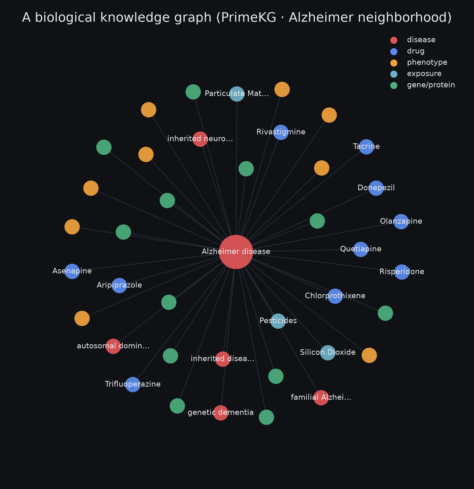
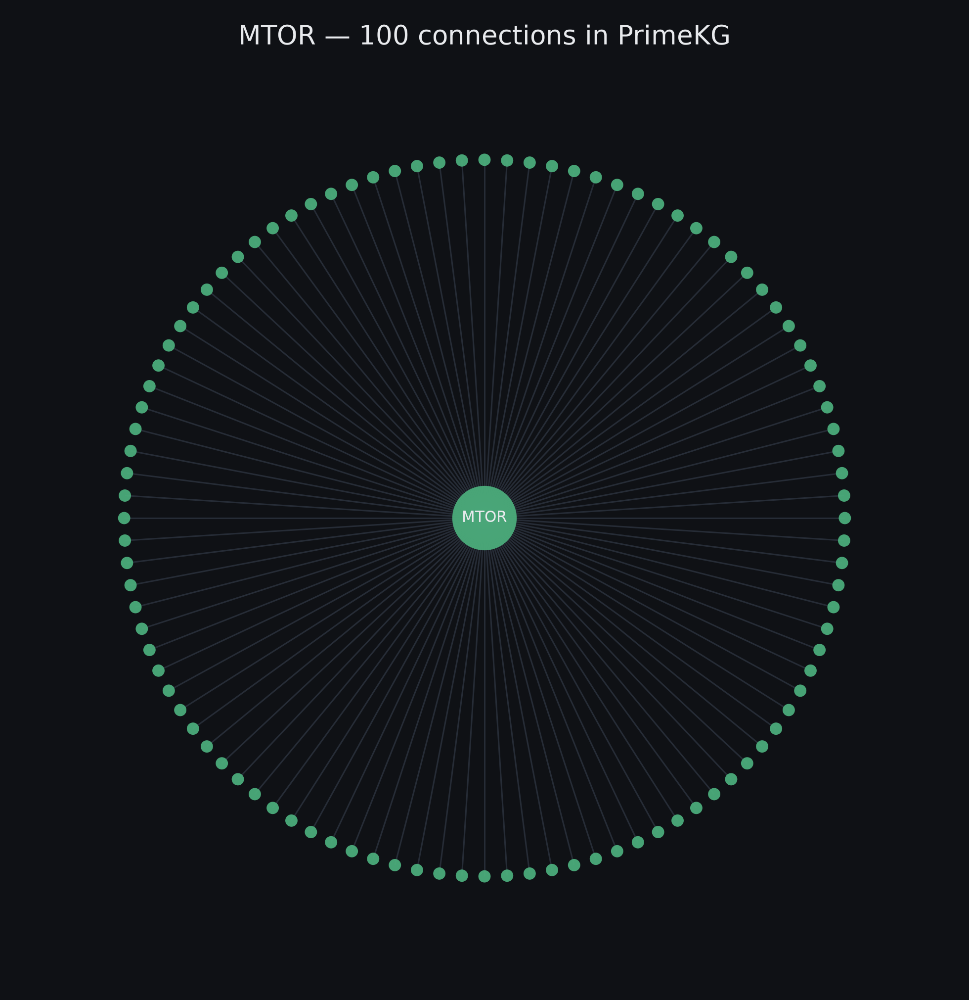
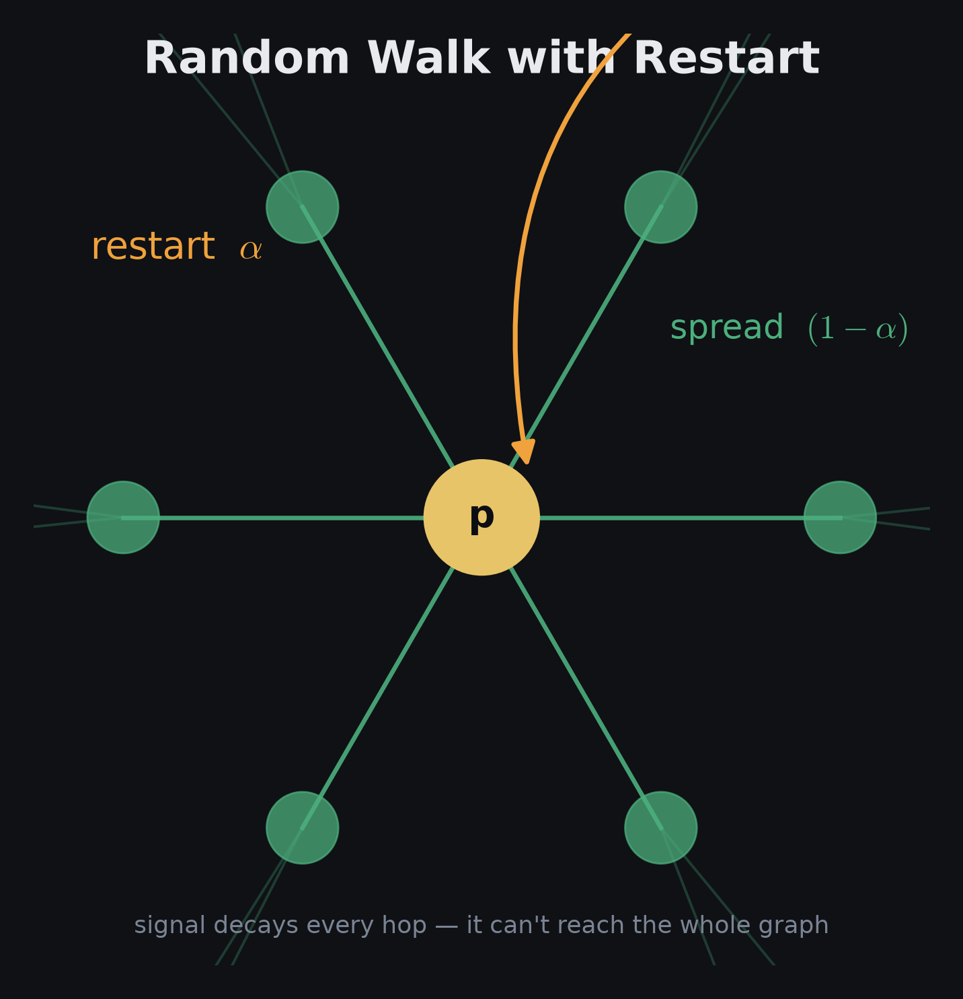
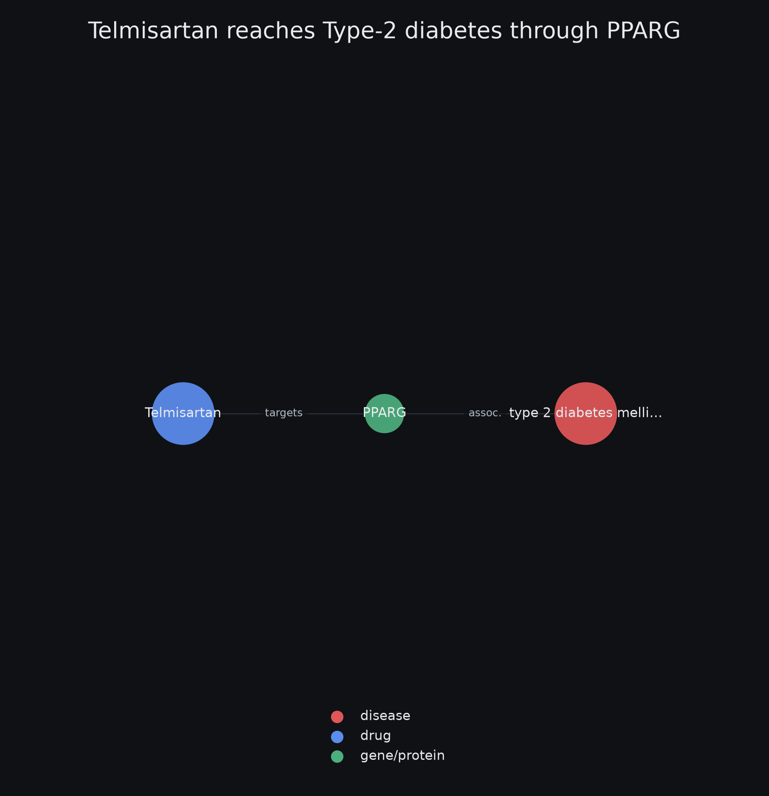

# Optimizing the Brain for Learning — a Network-Control Approach

A biomedical knowledge graph cast as a signed, directed control system — propagation via random-walk-with-restart, structural controllability, and multi-objective optimization over node perturbations.

*Model, not medical advice. Code: [github.com/DhruvSingh0905/cognitive-substrate-map](https://github.com/DhruvSingh0905/cognitive-substrate-map) · [overview](index.html)*

**129k KG nodes · 280 brain core · 2,871 signed edges · ρ(Ŵ) = 0.544 · N_D = 81**

## 01 · Substrate

Base graph: [PrimeKG](https://github.com/mims-harvard/PrimeKG), $|V|=129{,}375$, $|E|\approx4.05\times10^{6}$, 10 node types, 30 edge types (lineage: Hetionet/Rephetio hetnets, drug repurposing via metapath scoring).

**Brain-scoping.** Retain gene $v$ by tissue-expression enrichment over PrimeKG `anatomy_protein_present` edges $E_a$:

$$e(v)=\frac{\bigl|\{a:(v,a)\in E_a,\ a\in A_{\mathrm{brain}}\}\bigr|}{\bigl|\{a:(v,a)\in E_a\}\bigr|},\qquad \text{keep if } e(v)\ge 0.15 \ \wedge\ \deg_a(v)\ge 5$$

Layers (post-prune): intervention 70, input 15, readout 6, trap 2, expansion 187. Result: $N=280$, directed edges $3912$, signed $2871$ ($+{:}\,2253,\ -{:}\,618$), one SCC of $200$.

## 02 · Operator

Signed adjacency $W\in\{-1,0,+1\}^{N\times N}$, oriented so $(Wx)_i$ is influx to $i$: $W_{ij}=\operatorname{sign}(j\to i)$. Out-strength $d^{\mathrm{out}}_j=\sum_i|W_{ij}|$. Column-normalize ($D_{\mathrm{out}}=\operatorname{diag}(d^{\mathrm{out}})$):

$$\hat{W}=W\,D_{\mathrm{out}}^{-1},\qquad \hat{W}_{ij}=\frac{W_{ij}}{\sum_k|W_{kj}|}$$

**Spectral bound.** $|\hat{W}|$ is column-stochastic, so by Perron–Frobenius $\rho(\hat{W})\le\rho(|\hat{W}|)=1$ — guaranteeing §03 converges. Measured: $\rho(\hat W)=0.544$.

**Why column, not symmetric:**

| scheme | operator | spectrum | damps |
|---|---|---|---|
| PageRank / random-walk (used) | $W D_{\mathrm{out}}^{-1}$ | $\rho\le1$ (col-stochastic) | sender / out-hubs |
| GCN symmetric | $D^{-1/2}\tilde W D^{-1/2}$ | $\lambda\in[-1,1]$ | both endpoints |
| row random-walk | $D_{\mathrm{in}}^{-1}W$ | $\rho\le1$ | receiver / in-hubs |

Column form splits a regulator's outgoing influence across targets — correct for a directed graph where promiscuity is an *out*-degree property.

## 03 · Propagation (RWR / APPNP)

Source $p\in\mathbb{R}^N$, restart probability $\alpha$:

$$x^{(t+1)}=(1-\alpha)\,\hat{W}x^{(t)}+\alpha\,p$$

Fixed point solves $(I-(1-\alpha)\hat{W})x^{*}=\alpha p$. Since $\rho((1-\alpha)\hat{W})=(1-\alpha)\rho(\hat W)\le 1-\alpha<1$, the inverse exists and equals its Neumann series:

$$x^{*}=\alpha\bigl(I-(1-\alpha)\hat{W}\bigr)^{-1}p=\alpha\sum_{k\ge0}(1-\alpha)^{k}\hat{W}^{k}p$$

- Effective radius: mean hops $\bar k=(1-\alpha)/\alpha\approx5.7$ at $\alpha=0.15$.
- Over-smoothing limit: $\alpha\to0\Rightarrow x^{*}\to$ leading eigenvector of $\hat W$ (source-independent); the $(1-\alpha)^k$ decay is the guard; diagnostic $\operatorname{Var}_i(x^{*}_i)\not\approx0$.
- Feedback: the 200-node SCC ⇒ $x^{*}$ is a steady state under recurrence; the resolvent is required.

## 04 · Controllability

LTI form with input map $B\in\mathbb{R}^{N\times m}$: $\dot{x}=Wx+Bu$. Kalman: $(W,B)$ controllable iff

$$\operatorname{rank}\mathcal{C}=N,\qquad \mathcal{C}=[\,B,\ WB,\ W^{2}B,\ \dots,\ W^{N-1}B\,]$$

**Structural controllability (Lin; Liu–Barabási).** Controllable for almost all edge weights iff no dilation + spanned by inputs. Minimum driver count is set by a maximum matching $M^{*}$ on the bipartite $\mathcal{B}(V^{+},V^{-})$ (edge $j^{+}\!\to i^{-}$ for every $j\to i$):

$$N_{D}=\max\bigl(N-|M^{*}|,\ 1\bigr)$$

Computed via Hopcroft–Karp in $O(|E|\sqrt{N})$. Denser wiring ⇒ larger $M^{*}$ ⇒ fewer drivers: $\langle k\rangle\propto1/N_{D}$. Reachability: $R=\bigcup_{d\in\mathcal{D}}\operatorname{desc}(d)$.

| quantity | value |
|---|---|
| $\|\mathcal D\|$ druggable inputs | 172 |
| reachable $\|R\|/N$ | 280 / 280 |
| min drivers $N_D$ (full control) | 81 |
| drivers that are druggable | 35 / 81 |
| feedback SCC | 200 |

Full arbitrary-state control fails ($35<81$). But **target control** (Gao et al. 2014) — steering a readout subset $S\subsetneq V$ — needs $\le N_D$ inputs, and $R=V$ places every target in the reachable set, so it is feasible.

## 05 · Target & objective

Target deviation $d\in\mathbb{R}^N$; shapes: monotone (attractor at ceiling/floor), set-point (inverted-U, interior). Benefit = distance-reduction to the attractor:

$$b_i=\lvert d_i\rvert-\lvert x^{*}_i-d_i\rvert$$

A set-point at baseline has $d_i=0\Rightarrow b_i=-|x^{*}_i|$ (any displacement penalized). Aggregate ($w_i$ = confidence; readouts $w_i=0$) and cost ($L_1$ effort + off-target collateral):

$$B(p)=\sum_i w_i\,b_i,\qquad C(p)=\lVert p\rVert_1+\gamma\sum_{j\,\notin\,T}\lvert x^{*}_j\rvert$$

Curated target: 94 genes, $43$ set-point / $30$ up / $12$ down.

## 06 · Uncertainty quantification

Uncertain inputs $\theta$ = confidence-weight intervals + sign-only magnitudes. Monte-Carlo (GUM-S1): draw $\theta^{(m)}$, evaluate $Y^{(m)}=B(p;\theta^{(m)})$, report the order-statistic coverage interval:

$$\widehat{\mathrm{CI}}_{90\%}=\bigl[\,Y_{(\lceil0.05M\rceil)},\ Y_{(\lfloor0.95M\rfloor)}\,\bigr]$$

Attribute via Sobol indices:

$$S_i=\frac{\operatorname{Var}_{\theta_i}\!\bigl(\mathbb{E}[Y\mid\theta_i]\bigr)}{\operatorname{Var}(Y)},\qquad S_{T_i}=\frac{\mathbb{E}\bigl[\operatorname{Var}(Y\mid\theta_{\sim i})\bigr]}{\operatorname{Var}(Y)},\qquad S_{T_i}\ge S_i$$

$\arg\max_i S_{T_i}$ = the input whose verification most shrinks the band.

## 07 · Optimization

Vector program $\min_p (-B(p),\ C(p))$; solution = Pareto front. Traced exactly by ε-constraint:

$$\max_p\ B(p)\quad\text{s.t.}\quad C(p)\le\varepsilon$$

Weighted-sum $\max_p B(p)-\lambda C(p)$ is a supporting hyperplane of normal $(1,\lambda)$: recovers only $\partial\,\mathrm{conv}$ of the front, so on a non-convex front it *provably misses* concave regions for every $\lambda$. ε-constraint / NSGA-II do not. Small state space ⇒ exact inner solve is affordable.

## 08 · Validation

Test-driven (11 tests). Invariants: $\rho(\hat W)\le1$; resolvent $=$ truncated Neumann series to $10^{-8}$; sign propagation; real-substrate integration. Sign check — perturb $+1$, compare $\operatorname{sign}(x^{*})$ to raw edge signs ($\alpha=0.15$, $\rho(\hat W)=0.544$):

| perturb | → target | edge | $x^{*}$ | check |
|---|---|---|---|---|
| `CREB1 ↑` | BDNF | +1 | +0.0030 | ✓ |
| `CREB1 ↑` | JUN | −1 | −0.0027 | ✓ flip |
| `CREB1 ↑` | NTRK2 | +1→+1 | +0.0080 | ✓ net |
| `GSK3B ↑` | CREB1 | −1 | −0.0041 | ✓ inhib |
| `AKT1 ↑` | NFKB1 | +1→−1 | −0.0008 | ✓ net-flip |

**Hub-damping is observable:** 2-hop `NTRK2` ($+0.0080$) exceeds 1-hop `BDNF` ($+0.0030$) because $d^{\mathrm{out}}(\text{CREB1})\approx40$ divides its per-target transmission while $d^{\mathrm{out}}(\text{BDNF})=1$ transmits undivided — a direct consequence of $\hat W=WD_{\mathrm{out}}^{-1}$.

Telmisartan → PPARG → type-2 diabetes: a single shared node (off-target PPARγ agonism).

## 09 · Groundedness & assumptions

- **Rungs:** brain-scoping (computed) > edge sign/direction (curated) > edge magnitude (mostly sign-only) > objective (hand-built $d$).
- **Linearization:** $\hat W$ is the first-order Jacobian of the true nonlinear dynamics at baseline $x_0$; $x^{*}$ valid for small $\lVert x-x_0\rVert$. Large $\lVert p\rVert$ leaves the trust region (saturation, sign flips).
- **Deliverable:** a ranking of interventions and the trade-off front — ordinal, robust to linearization — not fold-change magnitudes, not a protocol.

---

**Stack:** PrimeKG · Neo4j · NetworkX · Personalized PageRank / APPNP · Liu–Barabási / Hopcroft–Karp · Kalman controllability · ε-constraint / Pareto · Monte-Carlo (GUM-S1) · Sobol indices

[Overview](index.html) · [GitHub](https://github.com/DhruvSingh0905/cognitive-substrate-map) · personal learning project — not medical advice.
